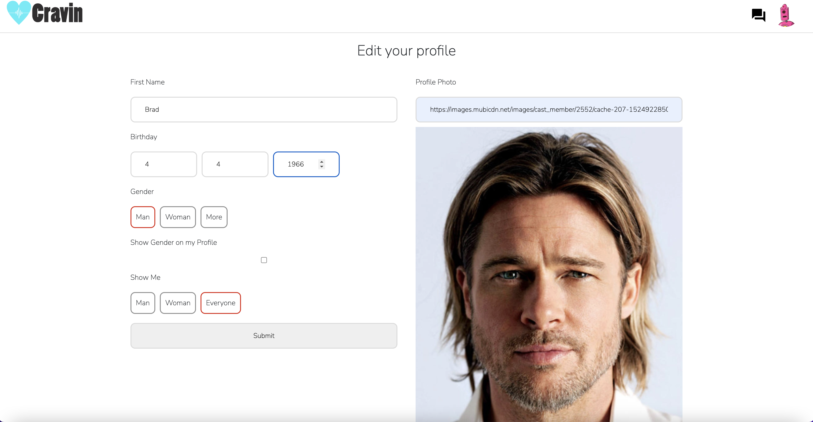

# Cravin

> Social meeting application to chat with anonymous users without being judged by an appearance or social status

## Table of contents

- [General info](#general-info)
- [Project Demo](#project-demo)
- [Project Video](#project-video)
- [Technologies](#technologies)
- [Setup](#setup)
- [Features](#features)
- [Inspiration](#inspiration)
- [Contact](#contact)
- [License](#license)

## General info

Cravin - Social meeting application that allows a user to chat and meet an anonymous user that has similar or opposite interests through users' answers to a shared question - for friends, relationship, help and all desires with only good intentions.

<div align="center">Welcome to Cravin. </div>
<br/>
<div align="center">
<kbd>

</kbd>
</div>

<br/>
<div align="center">
<kbd>

</kbd>
</div>

## Project Demo

[Click to view site](https://cravin0.herokuapp.com/)

## Project Video

[Click to view demo of Cravin](https://youtu.be/LVIyl2RZ61g)

## Technologies

### Backend Development

- Ruby 3.1.0
- Rails 7.0.3
- Redis
- Active_model_serializers 0.10.12
- Bcrypt 3.1.7
- postgresql 9.3

### Frontend Development

- JavaScript (ES6)
- HTML5
- CSS3
- React.js - version 18.2.0
- React-DOM - version 18.2.0
- React-Router-DOM - version 6.3.0
- React-Tinder-Card - version 1.4.5
- React-Moment - version 1.1.2
- Emotion/react - version 11.9.3
- Emotion/styled - version 11.9.3
- React-Scripts - version 5.0.1
- Sass - version 1.53.0
- React-bootstrap - version 2.4.0
- Material-UI - version 5.9.0
- Materialize-Icons - version 5.8.4

## Setup

To try out this project:

1. Clone the GitHub repository locally to your computer
1. In the command line, navigate to the root directory of the repository, and type the following:
   $ bundle install
1. Navigate to the client folder, and in the root directory of the client folder, type the following:
   $ npm install
1. In the client folder, and in the root directory of the client folder, type the following:
   $ npm start
1. Navigate back to the root directory of this project "cravin" and start the server by typing the following:
   $ rails server

## Code Examples

### Ruby on Rails

```Ruby on Rails
class SessionsController < ApplicationController
    skip_before_action :authorize, only: :create

  def create
    user = User.find_by(username: params[:username])
    if user&.authenticate(params[:password])
      session[:user_id] = user.id
      render json: user
    else
      render json: { errors: ["Invalid username or password"] }, status: :unauthorized
    end
  end

  def destroy
    session.delete :user_id
    head :no_content
  end

end
```

### JavaScript/React.js

```React.js
//handle click to set showModal to false
  function handleClick() {
    setShowModal(false);
  }
  //handle login and sign up form submit
  function handleSubmit(e) {
    //preventing page from refreshing
    e.preventDefault();
    // if showLogin is true which means user does not have an account and user put password and confirmPassword correctly
    if (showLogin && formData.password === confirmPassword) {
      //set errors to []
      setErrors([]);
      //set isloading to true
      setIsLoading(true);
      //create user with form Data in backend using fetch POST method
      fetch("/signup", {
        method: "POST",
        headers: {
          "Content-Type": "application/json",
        },
        body: JSON.stringify(formData),
      }).then((r) => {
        //set isLoading to false since request made
        setIsLoading(false);
        if (r.ok) {
          r.json().then((user) => {
            //set current user to signedup user
            setUser(user);
            //navigate to profile page
            navigate("/profile");
          });
        } else {
          r.json().then((err) => {
            //set errors message if request did go through
            setErrors(err.errors);
          });
        }
      });
      //reseting signup form inputs
      setFormData(form);
    } else if (!showLogin) {
      //else if user does have account and tries to login
      //set isLoading to true
      setIsLoading(true);
      //Login with username and password using fetch POST method which will create a session in the backend and authenticate the user
      fetch("/login", {
        method: "POST",
        headers: {
          "Content-Type": "application/json",
        },
        body: JSON.stringify({ username, password }),
      }).then((r) => {
        //set isLoading to false
        setIsLoading(false);
        if (r.ok) {
          r.json().then((user) => {
            //if request went through successfully then
            //set user with currently logged in user
            setUser(user);
            //check if user has already filled out their account profile or not
            if (!user.gender_identity && user.answer) {
              //if user has already filled out profile and answered the question then navigate to chat page directly
              navigate("/chat");
            } else if (!user.answer) {
              //elst if user has filed out profile but has not answered the question then navigate to question page
              navigate("/question");
            }
          });
        } else {
          r.json().then((err) => {
            // if not successful then set errorr message
            setErrors(err.errors);
          });
        }
      });
    } else {
      //if user did not put password and confirm password correctly then set errorr message
      setErrors("Please confirm your password");
    }
  }
```

## Features

- Full stack web application utilizing React and Ruby on Rails.
- Authorization and authenication implemented Rails Bcrypt.
- Front-End styles and components built with Material UI and React Boostrap.
- Users can create account through application.
- Users can add profile information, profile image.
- Users receive one question a day from the application and answers the question by YES or NO with a pitched message to show their thoughts on the question.
- Users can view other users' answers with thier anonymous basic profile according to similar & opposite preference.
- Users can request to chat other users.
- If the other user accepts the user’s request, then they can talk to each other through a chat only for a day.
- Users are permitted to only one request and acceptance for a conversation per day.
- Users can keep the conversation with the other user only if both of them are interested in talking
- Users are not allowed to talk to or see other users when they are in a conversation with other user which means that you can truly focus on only one.

Stretch Goal

- As relationship or conversation lasts, you can request to unlock the profile of the user if both willingly open
  Chat disappears after certain time period
- You will not be able to search your previous history of the chat or user id unless you really like the other user and both agree to share it to have conversation next day.

## Status

Project is: finished with option to expand functionality and DRY out code.

## Inspiration

The inspiration for this application came after having conversation with friends who are interseted in using the dating app to meet new people but, they are just afraid of giving a shot because they do not want to let others (not too close friends from high school, family, relative and etc.) know that they are on the dating application. This was very interesting because people always fantasize about meeting their perfect ones in natural settings and they understand that rarely happens not like movies. So, I asked myself that what if there is a social meeting app where profile is anonymous until start talking to other user on both consent. Users will only be able to see other users’ answers to a shared question, not their profile.
If a user likes another user’s answer, the user has to send a request to talk to the other user.
Then the other user who receives the request gets to decide if she or he is willing to accept the request or not. Once the request has been approved, both users will be able to see their picture and talk to each other. Now that both users are involved in talking to each other, They will not be able to see or request to talk to other users. This makes my application attractive especially when users want to build a solid relationship without worrying about whether their "maybe be" future partner is talking to other users at the same time while they talk and build a relationship.

## Contact

Created by [Hyun Sung Cho](https://www.linkedin.com/in/chothechallengebreaker/)
Feel free to contact me for any questions!

## License

[Click to view](https://github.com/hcho774/cravin/blob/main/LICENSE)
